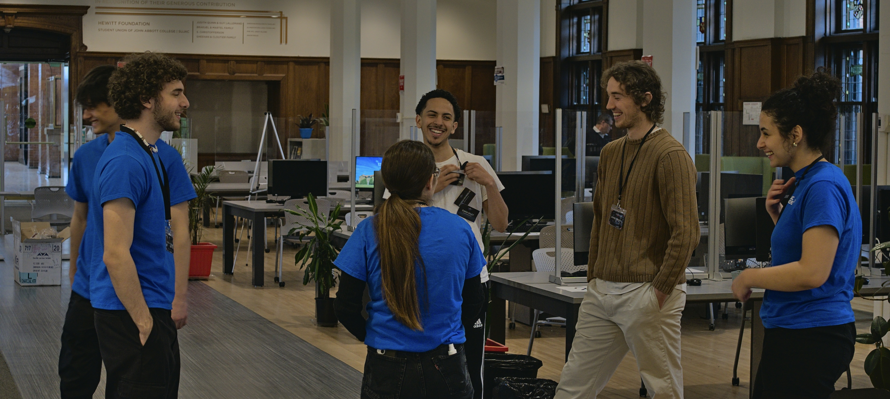

## 📌 Professional Stuff
- 👨‍💻 Currently working on a peer-to-peer clothing rental app called Peplo! It's sort of top secret so no links just yet 👀.
- 🧑‍💼 Also working as software development intern at General Electric, working on cool stuff like power grid simulation software and the architecture used to run it!

## 🏎️ Drive
My passion for technology stems from its ability to improve people's lives. Yes, advancement is certainly cool for advancement's sake, but we've lost the plot once we stop using it to help eachother and ourselves. I adore cutting edge technology which shows huge promise, and am absolutely obsessed with Quantum Computing's potential to reshape many aspects of our lives.

## 🔗 Links
- ✉️ Reach me [bringolfj@gmail.com](mailto:bringolfj@gmail.com)
- 🤝 Connect [www.linkedin.com/in/jeffreybringolf](https://www.linkedin.com/in/jeffreybringolf)
- 💼 Check out my projects and experiences [jeffbrin.github.io](https://jeffbrin.github.io) <a href="https://jeffbrin.github.io" target=_blank">jeffbrin.github.io</a>

> Most of my work is done on private repos or at work, so don't expect much here 😜

<!--
**jeffbrin/jeffbrin** is a ✨ _special_ ✨ repository because its `README.md` (this file) appears on your GitHub profile.

Here are some ideas to get you started:

- 🔭 I’m currently working on ...
- 🌱 I’m currently learning ...
- 👯 I’m looking to collaborate on ...
- 🤔 I’m looking for help with ...
- 💬 Ask me about ...
- 📫 How to reach me: ...
- 😄 Pronouns: ...
- ⚡ Fun fact: ...
-->

